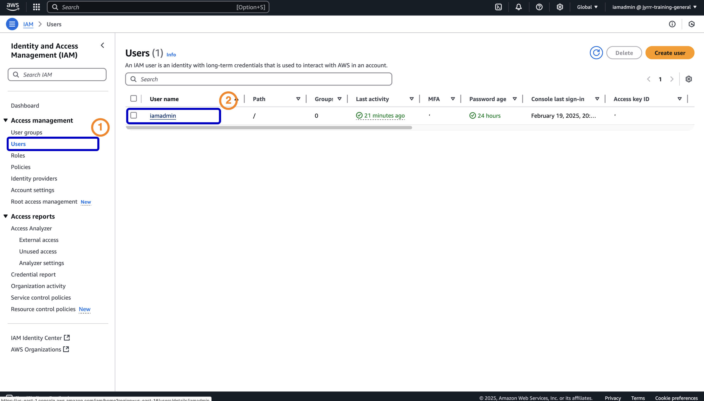
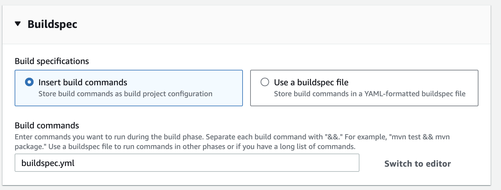
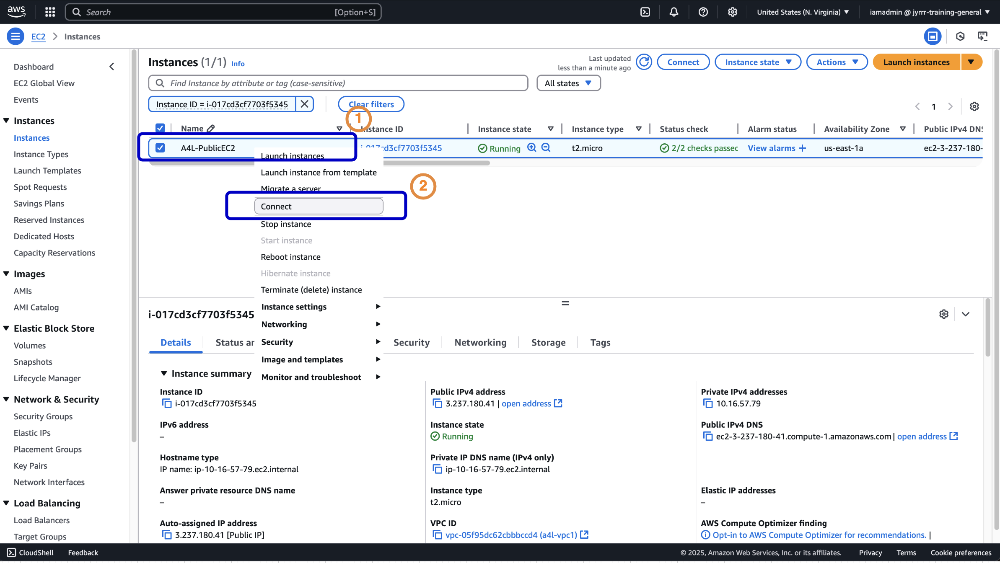

# Code Pipeline

## **Stage 1 - Configuring SSH for AWS CodeCommit and GitHub**


### **Step 1: Generate an SSH Key Pair**

1. Open a terminal on your local machine.
2. Run the following commands:
    ```
    cd .ssh
    ssh-keygen -t rsa -b 4096
    file name: codecommit
    password: 
    ```
    - When prompted for a password, press **Enter** twice.

3. Retrieve the public key:
    ```
    cat ~/.ssh/codecommit.pub
    ```
4. Copy the entire output to your clipboard.

---

### **Step 2: Upload the Public Key to AWS**

1. Open the **AWS IAM Console**.
2. Navigate to **Users** → Click on your user (`iamadmin`).
    
3. Click on **Security Credentials**.
4. Scroll down to **SSH Public Keys for AWS CodeCommit**.
5. Click **Upload SSH Public Key**.
    
6. Paste the copied public key.
7. Click **Upload SSH Public Key**.
    

---

### **Step 3: Configure the SSH Config File**
1. Open the terminal and edit the SSH config file:
    - enter this: `nano ~/.ssh/config`
2. Add the following lines at the top of the file:
    ```
    Host git-codecommit.*.amazonaws.com
    User KEY_ID_YOU_COPIED_ABOVE_REPLACEME
    IdentityFile ~/.ssh/codecommit
    ```
  

3.  Save and exit (`CTRL + X`, then `Y`, then `Enter`).
4. Set correct file permissions:
    ```
    chmod 600 ~/.ssh/config
    ```


---
### **Step 4: Test SSH Authentication**
1. Run the following command:
    ```sh
    ssh git-codecommit.us-east-1.amazonaws.com
    ```
2. If prompted, type **yes**.
3. If successful, you should see:
    ```
    You have successfully authenticated over SSH.
    ```

---


### **Step 5: Create a GitHub Repository**
1. Go to [GitHub](https://github.com/).
2. Create a new repository.
3. Name it: `catpipeline-codecommit-XXXX`.
4. Click **Code** → Select **SSH** → Copy the SSH URL.
    

---
### **Step 6: Attach SSH Key to GitHub**
1. Open GitHub → **Settings**.
2. Navigate to **SSH and GPG keys**.
3. Click **New SSH Key**.
4. Paste the SSH key you generated earlier.
5. Click **Add SSH Key**.

---

### **Step 7: Test Your SSH Connection**
1. Open the terminal.
2. Run the following command:
    ```sh
    ssh -T git@github.com
    ```
3. If successful, you should see:
    ```
    Hi username! You've successfully authenticated, but GitHub does not provide shell access.
    ```

---

### **Step 8: Clone the GitHub Repository**
1. Paste the SSH, and add `git clone` at the beginning. example command:
    ```sh
    git clone git@github.com:your-username/catpipeline-codecommit-XXXX.git
    ```
2. Move into the cloned folder:
    ```sh
    cd catpipeline-codecommit-XXXX
    ```

---

### **Step 9: Add the Demo Code**
1. Download and extract this folder: [container.zip](container.zip).
2. Copy the extracted files to your cloned GitHub folder:
    - Option 1: `Terminal`
    ```sh
    mv ~/Downloads/container/* ~/catpipeline-codecommit-XXXX/
    ```
   -  Option 2: `Finder`
        - Paste the extracted files on `catpipeline-codecommit-XXXX` folder

---

## **Stage 2 - CodeBuild Setup**

### **Step 1: Create an Amazon ECR Repository**
1. Open the **ECR console**.
2. Click **Create**.
    
3. Name the repository **`catpipeline`**.
4. Click **Create**.
    


---

### **Step 2: Create a CodeBuild Project**
1. Open the **AWS CodeBuild Console**.
2. Click **Create build project**.
3. Under **Project configuration**:
   - **Project name**: `catpipeline-build`


#### **Step 2.1: Configure the Source**
1. Under **Source provider**, select **GitHub**.
2. Under **Credentials**:
   - Click **Manage account credentials**.
     
   - Click **Create a new GitHub connection**.
     
   - Enter a **Connection name**.
     
   - Enter GitHub credentials and click **Sign in**.
     
   - Click **Authorize**.
     
   - Go back to **Manage default source credentials**, select the **Connection name**.
     
   - Click **Save**.
3. Under **Repository**, select **Repository in my GitHub account**.
4. Under **GitHub repository**, select the repository you created earlier.

📌 **Your configuration should look like this:**
   


---

#### **Step 2.2: Configure the Build Environment**
1. Expand **Environment**.
2. Configure the following:
   - **Provisioning model**: `On-demand`
   - **Environment image**: `Managed image`
   - **Compute**: `EC2`
   - **Operating System**: `Amazon Linux`
   - **Runtime**: `Standard`
   - **Image**: `aws/codebuild/amazonlinux-x86_64-standard:5.0` _(Select the latest)_
   - **Image version**: `Always use the latest`
   - **Service role**: `New service role`
   - **Role name**: `codebuild-catpipeline-build-service-role`
3. Expand **Additional configuration**:
   - Enable **Privileged mode**.
   - Add the following **Environment variables**:
     ```sh
     AWS_DEFAULT_REGION = us-east-1
     AWS_ACCOUNT_ID = your_AWS_ACCOUNT_ID_REPLACEME
     IMAGE_TAG = latest
     IMAGE_REPO_NAME = your_ECR_REPO_NAME_REPLACEME
     ```
     
     

---

#### **Step 2.3: Configure Buildspec**
1. Under **Buildspec**, configure the following:
   - **Build specifications**: `Insert build commands`
   - **Build commands**: `buildspec.yml`
   

---

#### **Step 2.4: Configure Logs**
1. Expand **Logs**.
2. Enable **CloudWatch logs**.
3. Configure the following:
   - **Group name**: `a4l-codebuild`
   - **Stream name prefix**: `catpipeline`

----

### **Step 3: Create the Build Project**
1. Click **Create build project**.
    


---
#### TROUBLESHOOTING

* **Handling Webhook Errors**
If you encounter the following error:
   

    1. Click **Edit project**.
    2. Under **Service role**, select the **ARN** that includes:  

---

### **Step 4: Configure Security and Permissions**
1. Open the **IAM Console**.
2. Click on **Roles**.
3. Find and click on **codebuild-catpipeline-build-service-role**.
4. Navigate to the **Permissions** tab.
5. Click **Add permissions**.
6. Select **Create inline policy**.
    
7. Click **JSON** and insert the following policy:
    ```json
    {
      "Statement": [
        {
          "Action": [
            "ecr:BatchCheckLayerAvailability",
            "ecr:CompleteLayerUpload",
            "ecr:GetAuthorizationToken",
            "ecr:InitiateLayerUpload",
            "ecr:PutImage",
            "ecr:UploadLayerPart"
          ],
          "Resource": "*",
          "Effect": "Allow"
        }
      ],
      "Version": "2012-10-17"
    }
    ```
8. Click **Next**.
9. Enter **Policy name**: `Codebuild-ECR`.
10. Click **Create policy**.

---

### **Step 5: Configure `buildspec.yml`**
1. Open your **local code editor** (e.g., **VS Code**).
2. Select all text and **convert tabs to spaces**.
    
3. Open **Terminal** and commit the changes:
    ```sh
    git add -A .
    git commit -m "Add buildspec.yml"
    git push 
    ```
4. Check **GitHub** to verify that `buildspec.yml` is successfully added.
    

---


### **Step 6: Test the CodeBuild Project**
#### **Step 6.1: Run the CodeBuild Project**
1. Open the **AWS CodeBuild Console**.
2. Locate the **Build project**.
3. Click **Start build**.
    

---

#### **Step 6.2: Verify the Build in ECR**
1. Open the **Amazon ECR Console**.
2. Click on the **catpipeline** repository.
3. You should see a **Docker image** inside the repository.
    

---


### STEP 7. TEST THE DOCKER IMAGE
#### **Step 7.1: Deploy an EC2 Instance with Docker Installed**
1. Click this [LINK](https://us-east-1.console.aws.amazon.com/cloudformation/home?region=us-east-1#/stacks/quickcreate?templateURL=https://jru-labs.s3.us-east-1.amazonaws.com/Pipeline/EC2+Dockerhost+Demo.yml&stackName=DOCKER) to launch a CloudFormation stack 
2. Accept all default settings.
3. Accept all default settings.
4. Check the acknowledgment checkbox and create the stack.
5. Wait until the stack status changes to `CREATE_COMPLETE` in CloudFormation.

#### **Step 7.2: Connect to the EC2 Instance**
1. Go to `resources` tab, locate `public ec2`, click and move to the ec2 console
    
2. Select the instance, right click and select `connect`
    
3. Select `EC2 instance connect`, click `connect`

#### **Step 7.3: Verify Docker Installation**
1. Run the following command to check Docker is running:
    `docker ps`
* It should return an empty list if no containers are running.


#### **Step 7.4: Authenticate Docker with Amazon ECR**
1. Run the following command to retrieve login credentials for ECR:
    ```
    aws ecr get-login-password --region us-east-1 | docker login --username AWS --password-stdin <AWS_ACCOUNT_ID>.dkr.ecr.us-east-1.amazonaws.com
    ```
2. Replace <AWS_ACCOUNT_ID> with your actual AWS Account ID (without dashes).

#### **Step 7.5: Pull the Docker Image from ECR**
1. Open the ECR Console
2. Navigate to `Repositories`.
3. Click the `catpipeline` repository.
4. Copy the `Image URI` for the `latest` version.
5. Run the following command to pull the image:
    `docker pull <ECR_IMAGE_URI>Replace <ECR_IMAGE_URI> with the copied image URI.`

#### **Step 7.6: Run the Docker Container**
1. List the pulled Docker images:
    `docker images`
2. Locate the `IMAGE ID` for the catpipeline image and copy it.
3. Run the container, replacing <IMAGE_ID> with the copied value:
    `docker run -p 80:80 <IMAGE_ID>`

#### **Step 7.7: Verify the Running Container**
1. Open the EC2 Console.
2. Go to `Instances` and locate `A4L-PublicEC2`.
3. Copy the `Public IPv4` Address.
4. Open a browser and visit:
    ```
    http://<PUBLIC_IP>
    ```
5. Replace <PUBLIC_IP> with the copied IPv4 address.
6. If successful, you should see a page with cats in containers confirming your deployment works!